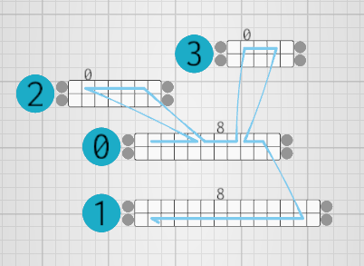
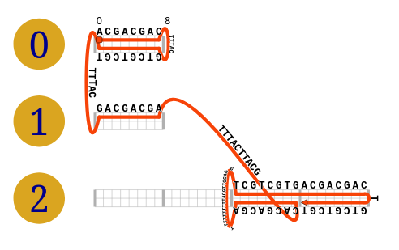

# About

ENSnano is a software for designing DNA nanostructures. 

ENSnano takes up the concepts of existing DNA nanostructures design softwares such as
[cadnano](https://cadnano.org/) and extends them with additional features. Notable features of
ENSnano include

* A 3D editable view synchronized with a 2D cadnano-like interface
* 3D and 2D cross-over recomendations based on the structure's geometry
* An interative and geometry aware copy and paste functionality

Currently, ENSnano can only produces sequences for DNA origamis.

For more details about ENSnano you can checkout the paper introducing it in the proceedings of the
[DNA27 conference](http://dna27.iopconfs.org/home): 

> <ins> ENSnano: a 3D modeling software for DNA nanostructures </ins>
   Nicolas Levy and Nicolas Schabanel.
   DNA 2021 *Proceedings of the 27th International Conference on DNA Computing and Molecular Programming*
   [pdf](https://drops.dagstuhl.de/opus/volltexte/2021/14672/pdf/LIPIcs-DNA-27-5.pdf)

You can also see [here](https://www.youtube.com/watch?v=NPH-ukYMhdY) the talk presented at
the conference.

# Installation

We try to frequently release binaries for Windows and MacOS.
Alternatively you can also clone this repository and build the software from source.

## Dependencies 
### All platforms

You need to have the latest rust compiler installed see [this page](https://www.rust-lang.org/tools/install).

** If you already have `cargo` installed but face compilation issue, make sure that you have the lastest version by running `rustup update` **

### Linux
You need the GTK3 development packages, and a C++ compiler to build the dependency `rfd`.

* Debian/Ubuntu: `apt-get install build-essential libgtk-3-dev`
* Fedora: `dnf install gtk3-devel`
* Arch: `pacman -S gtk3`

You also need to have the **Vulkan** driver for your graphic card installed. The installation methods depends on your distribution and graphic card,
but there should be a tutorial on the internet for any combination of those.

## Compiling from source

Clone the repo

`git clone https://github.com/thenlevy/ensnano.git`

Run ensnano with

`cd ensnano`
`cargo run --release`

# Importing Cadnano/Scadnano files

ENSnano does not currently handles deletions/loops/insertions in its designs. Here is how these features are handled
when importing a cadnano/scadnano file

* The nucleotides that are "deleted" are removed from the design
* Insertions are replaced by a single strand on an attributed helix

## Example

In this cadnano design, deleted nucleotides are removed and loops are replaced by single strands

 

In this scadnano design, insertions and loopouts are replaced by single strands

 

# Thirdparties

The licenses of the dependencies are listed in `thirdparties/license.html`

This software uses the following fonts which are distributed under the SIL OpenFont License
* [Inconsolata-Regular](https://fonts.google.com/specimen/Inconsolata)
* [Inter](https://fonts.google.com/specimen/Inter) (Glyphs from this font are used in the file `font/ensnano2.ttf`)

The font `font/DejaVuSansMono.ttf` is in public domain.
